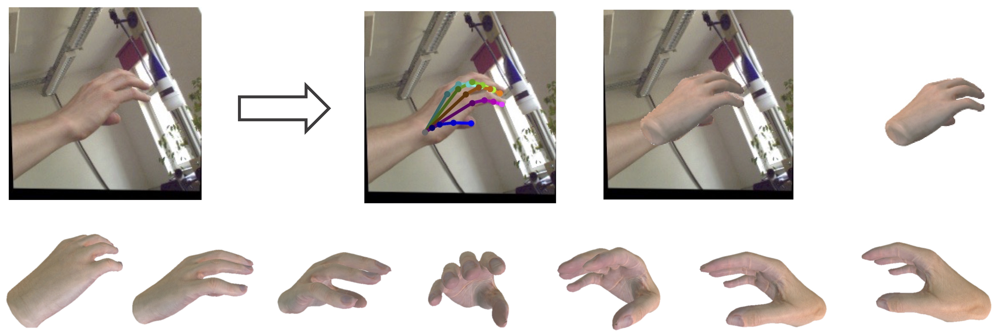
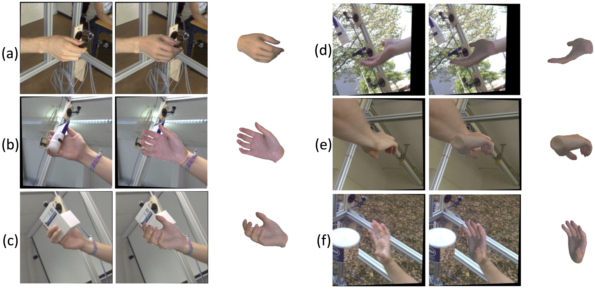
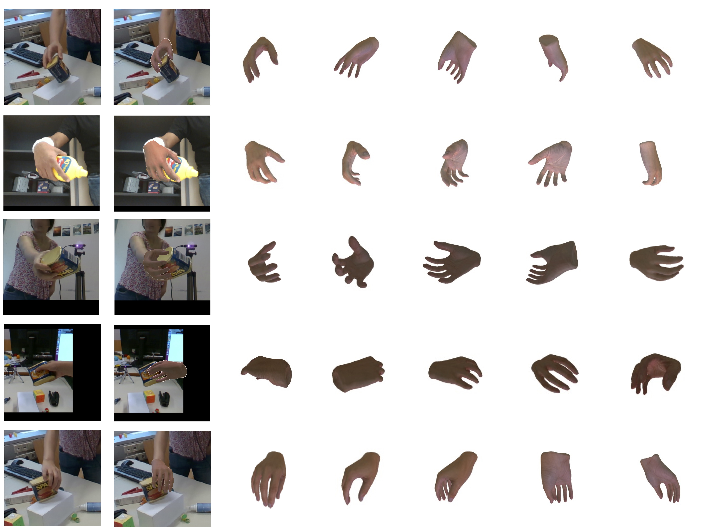

<div align="center">
<h1 align="center">
<br><strong>HiFiHR</strong>: <strong>Hi</strong>gh-<strong>Fi</strong>delity <strong>H</strong>and <strong>R</strong>econstruction
</h1>
<h2> Enhancing 3D Hand Reconstruction from a Single Image via High-Fidelity Texture </h2>

<p> Development Time:
 +

</p>
<p>


</p>
</div>

---

## 📒 Table of Contents

- [📍 Overview](#-overview)
- [🚀 Getting Started](#-getting-started)
- [🛠 Training and Evaluation](#-training-and-evaluation)
- [👏 Acknowledgments](#-acknowledgements)
- [📄 Citation](#-citation)


## 📍 Overview


| FreiHAND | HO-3Dv2 |
| ---- | ---- |
|  |  |

### 🎯 Features

- **Objective:** Generate realistic 3D hand meshes with accurate textures from a single image.

- **Supervision Levels:** Utilize self-supervision, weak supervision, and full supervision.

- **Contributions of High-Fidelity Textures:** Enhance hand pose and shape estimation with learned high-fidelity textures.

- **Benchmark Performance:** Experimental evaluations on public benchmarks (FreiHAND and HO-3D). Outperform state-of-the-art methods in texture quality, while maintaining accurate pose and shape estimation.

## 🚀 Getting Started

### 📦 Environment

This code is developed under Python 3.9, Pytorch 1.13, and cuda 11.7.

- (Optional) You may need to wake up your conda:

```sh
conda update -n base -c default conda
conda config --append channels conda-forge
conda update --all
```

- Create the environment and install the requirements:

```sh
conda env remove -n hifihr
conda create -n hifihr python=3.9
conda activate hifihr
conda install pytorch=1.13.0 torchvision pytorch-cuda=11.7 -c pytorch -c nvidia

conda install -c fvcore -c iopath -c conda-forge fvcore iopath
# conda install pytorch3d -c pytorch3d
pip install "git+https://github.com/facebookresearch/pytorch3d.git"

conda install tqdm tensorboard transforms3d scikit-image timm trimesh rtree opencv matplotlib rich lpips
pip install chumpy
```

### 📂 Datasets

For 3D hand reconstruction task on the FreiHAND dataset:
- Download the FreiHAND dataset from the [website](https://lmb.informatik.uni-freiburg.de/resources/datasets/FreihandDataset.en.html).

For HO3D dataset:
- Download the HO-3Dv2 dataset from the [website](https://www.tugraz.at/index.php?id=40231).

## 🛠 Training and Evaluation

Pre-trained models can be downloaded from the [Google Drive link](https://drive.google.com/drive/folders/16f-qZiTQnVGNJqLiAezd-amhYwO2JsxY?usp=sharing).

### 🧪 FreiHAND

- Evaluation: 

```
python train_hrnet.py --config_json config/FreiHAND/evaluation.json
```

- Training:

```
python train_hrnet.py --config_json config/FreiHAND/full_rhd_freihand.json
```

Note: remember to check and inplace the dirs and files in the ```*.json``` files.

### 🧪 HO3D

- Evaluation: 

```
python3 train_hrnet.py --config_json config/HO3D/evaluation.json
```
- Training: Please refer to FreiHAND training scripts.

## 👏 Acknowledgements

We would like to thank to the great project in [S<sup>2</sup>HAND](https://github.com/TerenceCYJ/S2HAND).

## 📄 Citation

If you find this code useful for your research, please consider citing:

```bibtex
@inproceedings{zhu2023hifihr,
    title={HiFiHR: Enhancing 3D Hand Reconstruction from a Single Image via High-Fidelity Texture},
    author={Zhu, Jiayin and Zhao, Zhuoran and Yang, Linlin and Yao, Angela},
    booktitle={German Conference on Pattern Recognition},
    year={2023},
    organization={Springer}
}
```
